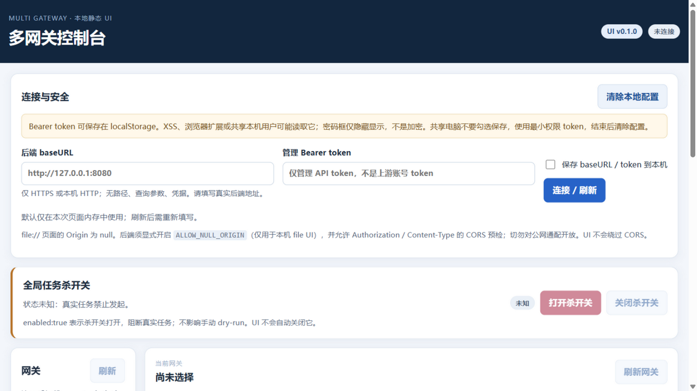
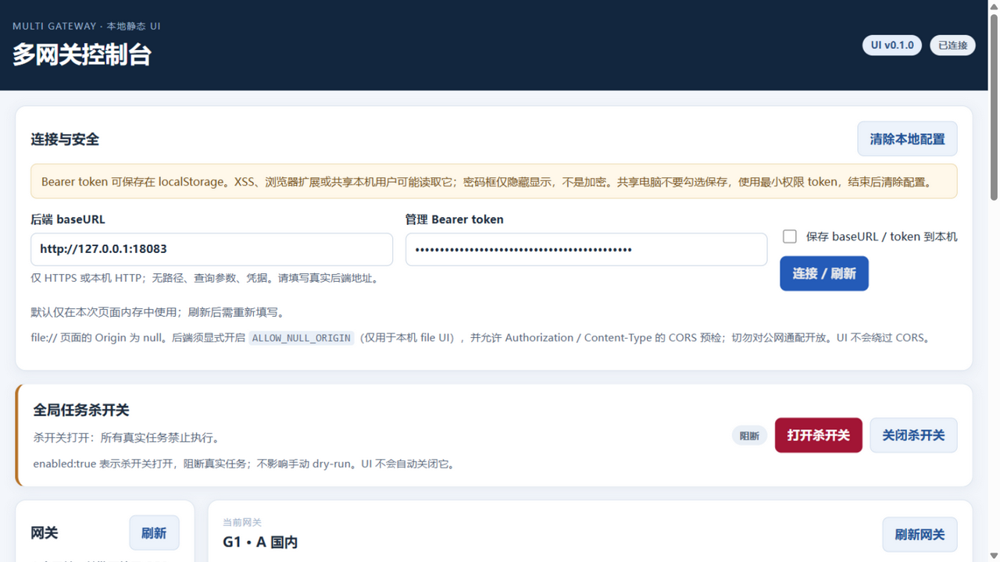
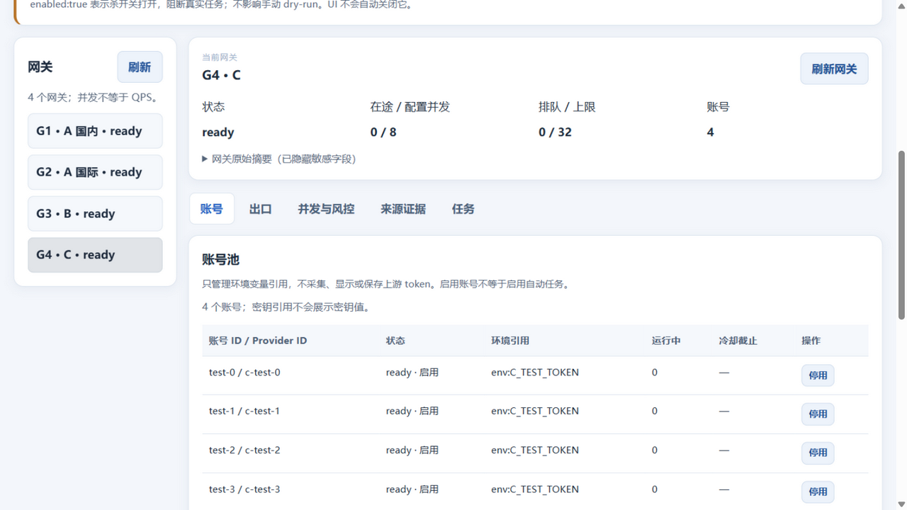
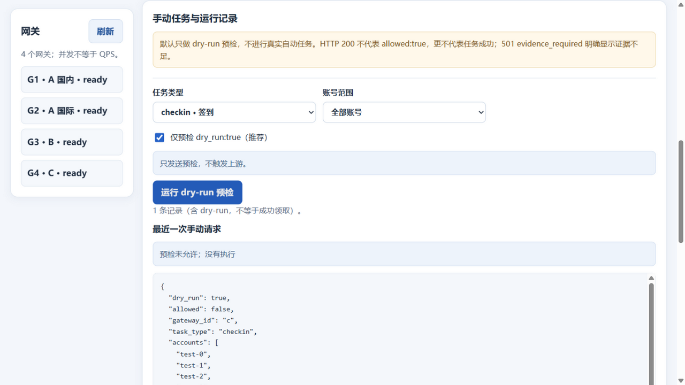

# 本地静态 UI GUI 测试

环境准备：本机隔离fixture，四网关openai模式，各4测试账号，不使用真实服务；UI独立标准库http.server127.0.0.1:18081，后端18083，CORS精确允许UI。模拟管理员Token明确非生产，仅页面内存，不勾保存。

## T1 初始加载 PASS

DOM及截图确认默认未连接、真实按钮禁用、localStorage风险提示、四网关入口位置，无外部脚本。

## T2 连接本机后端 PASS

正常填BaseURL和Token后点击连接，DOM确认4gateway、kill enabled=true、后端0.1.0；截图确认连接状态和杀开关。没有用JS注入触发业务。

## T3 切换 G4 PASS（已修正并复测）

正常点击G4，截图最终显示C账号引用env:C_TEST_TOKEN、4账号、8并发、32队列。DOM立即采样曾出现标题C而旧A账号短暂仍在；不是数据后端混用，但UI可混淆。测试结束后修正select时清空旧表/禁用设置；重新加载代码并正常填写/连接后复测，立即DOM为C标题且空表，没有旧A账号；随后viewport截图为正确C账号，修复PASS。

## T4 任务 dry-run PASS

点击任务tab、dry-run预检，DOM返回allowed=false、kill/disabled/evidence原因；截图显示“预检未允许：没有执行”，不是成功领取。

## 阻塞与限制

IAB全页截图存在拼接重复，故不用该图作为布局证据；以上viewport截图已实际查看。file://直接打开受浏览器运行时导航能力限制，本轮GUI通过独立本机静态server等价内容测试，file Origin:null仍未端到端验证。未测试所有CRUD、窄屏、键盘可达性、localStorage重载、真实GitHubRelease。运行时没有可用console收集接口，本轮未获取console日志；未观测空白/脚本报错。不得称“UI全验收”。
